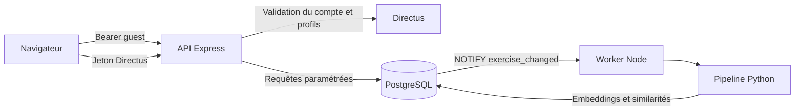

# Déployer RUMBA.EX et comprendre ses frontières de données

Le dépôt propose une démonstration autonome et des composants de serveur. Le service hébergé présenté sur [Pragma Learning Institute](https://pragmalearninginstitute.com/rumba-ex) possède sa propre intégration au site. Copier les sources ne reproduit pas automatiquement ses comptes, son catalogue ou son infrastructure.

## Architecture et contrats

L'API écoute sur `127.0.0.1:3001` par défaut. `SERVE_WEB=true` sert uniquement le dossier `web/`. La racine du dépôt, les journaux et les fichiers de configuration ne doivent jamais être exposés comme répertoire statique.

| Variable | Valeur par défaut / usage |
| --- | --- |
| `HOST`, `PORT` | `127.0.0.1`, `3001` |
| `PGHOST`, `PGPORT`, `PGUSER`, `PGPASSWORD`, `PGDATABASE` | Paramètres de connexion PostgreSQL ; base `rumba_dev` par défaut |
| `DIRECTUS_URL` | Instance Directus, `http://127.0.0.1:8055` par défaut |
| `CORS_ORIGIN` | Origines exactes séparées par des virgules ; `http://127.0.0.1:3001` |
| `TRUST_PROXY` | Vide par défaut ; adresses ou réseaux des seuls mandataires de confiance |
| `RUMBA_EX_ALLOW_REGISTRATION` | Inscription désactivée, activation explicite par `true` |
| `RUMBA_EX_DIRECTUS_ROLE_ID` | Rôle restreint nécessaire à l'inscription |
| `SERVE_WEB` | `true` pour servir le navigateur sur la même origine |

Ne pas utiliser une règle de mandataire universelle. Le mandataire frontal doit remplacer les en-têtes transmis par le client. Le limiteur utilise l'adresse déterminée par Express, purge les entrées expirées et borne le nombre d'identités conservées. Il est local au processus : plusieurs instances nécessitent une limitation partagée en amont.

## Utiliser l'API

Le préfixe public est `/rumba-ex/api`. Les alias sans ce préfixe facilitent les mandataires locaux.

| Route | Autorisation | Effet |
| --- | --- | --- |
| `GET /health` | Aucune | Disponibilité du processus ; ne teste pas PostgreSQL |
| `POST /auth/login` | Identifiants Directus | Obtention des jetons via Directus |
| `POST /auth/register` | Activation explicite et rôle restreint | Création de compte dans Directus |
| `/profiles` | Jeton Directus | Profils du compte ; contrôle du propriétaire |
| `POST /recommend` | `Bearer guest` ou jeton Directus | Classement ; un profil sauvegardé exige son propriétaire |
| `POST /recommend/feedback` | Propriétaire du profil | Retour sur un exercice enregistré |
| `POST /recommend/history/reset` | Propriétaire du profil | Réinitialisation de l'historique du profil |

L'exemple invité du [guide de démarrage](getting-started.fr.md) ne crée pas de profil. La limitation de l'âge à 6–14 et du nombre d'exercices à 1–5 est vérifiée par l'API. Les erreurs retournées n'exposent pas les détails SQL.

## Comptes et Directus

Configurer Directus séparément selon sa [documentation officielle](https://directus.io/docs/). `server/rumba-ex-directus-schema.json` et le script de configuration décrivent les collections attendues. Examiner le script avant de l'exécuter sur une instance de développement. Les versions de Directus et les politiques installées doivent être compatibles ; aucune instance de production n'est fournie.

Le rôle public ne doit pouvoir lire ni profils ni historiques. Le rôle des utilisateurs doit être filtré par `user_created = $CURRENT_USER`. Les permissions de lecture, création, modification et suppression sont toutes à vérifier avec deux comptes de test distincts. Le serveur vérifie également la propriété ; Directus reste une frontière de sécurité à configurer. Le compte d'administration n'est pas un compte d'exécution pour l'application.

Le schéma natif Swift utilise notamment `student_profile` et `exercise_id`, alors que l'API attend des collections Directus et `exercise_uuid` dans son historique. Ne pas substituer automatiquement un schéma à l'autre. `schema/000_development.sql` suffit au parcours invité ; les scripts complémentaires servent à des intégrations distinctes.

## Données, navigateur et exports

L'application peut conserver un état local dans le navigateur. Le mode hébergé possède des appels d'intégration au compte PLI ; en installation autonome, le jeton Directus est utilisé. Une session de navigateur partagée doit être fermée et ses données locales effacées après usage. Ne saisir que des profils fictifs pendant le développement.

La télémétrie est désactivée dans cette édition. Son activation exige `window.RUMBA_TELEMETRY_ENABLED = true` et une URL de collecte explicitement configurée. Définir aussi les informations aux utilisateurs et la politique de conservation avant toute collecte. Les bibliothèques d'export web peuvent être chargées depuis des CDN : elles doivent être hébergées localement si un fonctionnement hors réseau est requis.

## Pipeline et tâches planifiées

Le worker s'exécute depuis `server/` après `npm ci`. Il utilise `RUMBA_DB_URL` ou les variables `PG*`, `RUMBA_ML_PYTHON` pour l'interpréteur et `RUMBA_ML_PIPELINE_SCRIPT` pour le script. Les journaux sont locaux par défaut. Le fichier PM2 est `rumba-ex-worker.ecosystem.config.cjs`. Le script `rumba-ex-ml-cron.sh` peut être lancé par un planificateur de votre choix. Ne pas lancer simultanément plusieurs recalculs sur le même catalogue sans coordination.

Installer le trigger `server/trigger_ml_notify.sql` uniquement dans la base prévue. Il invalide l'embedding lors de la création ou d'une modification du titre/contenu. Les écritures d'embeddings ne réémettent pas elles-mêmes cette notification. Voir [le guide des embeddings](embeddings.fr.md) pour les options et le sens du mode `--dry-run`.

## Avant un hébergement public

Utiliser HTTPS, des secrets injectés hors de Git, un rôle SQL limité, des permissions Directus testées, une politique de suppression et des sauvegardes protégées hors du dépôt. Le client Swift accède directement à PostgreSQL : le réserver à des postes et réseaux de confiance. Le choix d'un nom dans l'application native n'isole pas les utilisateurs comme une authentification serveur.

Un audit partiel et des tests locaux ne garantissent pas l'absence de vulnérabilité. [SECURITY.md](../SECURITY.md) décrit les protections de cette édition et le signalement d'un problème.
